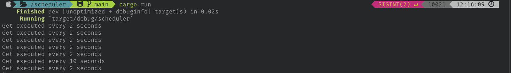

# scheduler
schedule things to run frequently with Rust

time specified for UTC, not local timezone

scheduling format is Cron format, so...
```
sec   min   hour    day of the month    month   day of the week   year
*     *     *       *                   *       *                 *
```

### Output:

